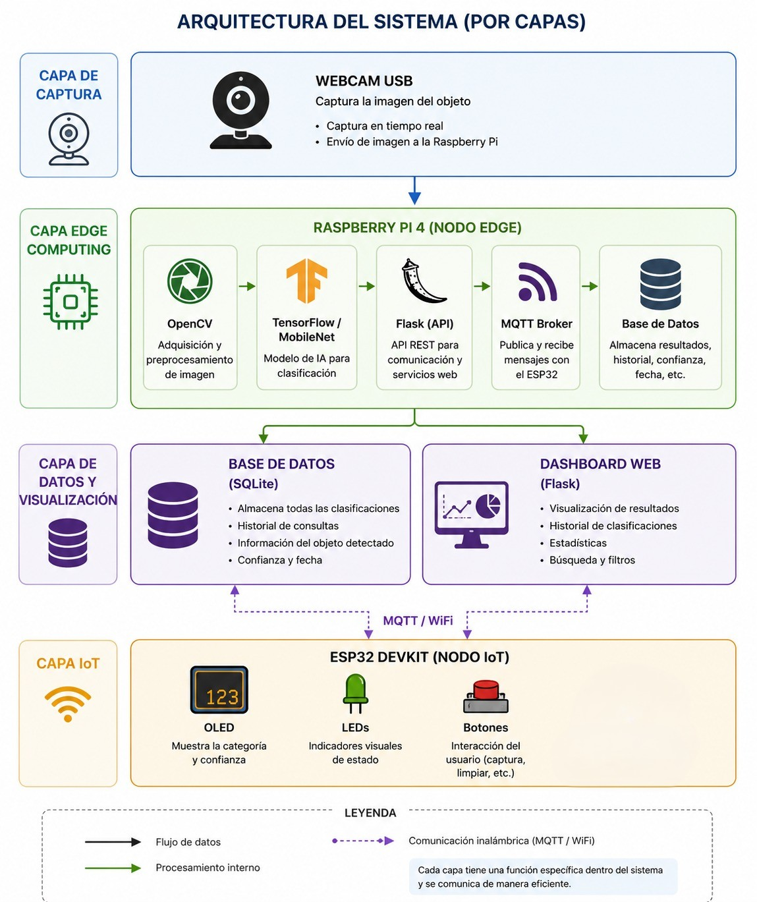

# ProyectoIoT
# Sistema IoT de Búsqueda y Clasificación Visual mediante Edge Computing

Sistema IoT capaz de identificar automáticamente la categoría o franquicia a la que pertenece un objeto visual utilizando técnicas de Visión Artificial, Machine Learning y Edge Computing.

El sistema captura imágenes mediante una webcam conectada a una Raspberry Pi, procesa la información localmente utilizando modelos de Inteligencia Artificial y distribuye los resultados a dispositivos IoT mediante MQTT.

---

## Objetivo

Desarrollar un sistema IoT capaz de identificar automáticamente la categoría a la que pertenece una imagen, dibujo, figura, producto coleccionable o elemento visual, utilizando visión artificial y dispositivos Edge conectados en red.

---

## Arquitectura del Sistema



El sistema está dividido en cuatro capas principales:

### 1. Capa de Captura

Responsable de adquirir imágenes del entorno.

- Webcam USB
- Captura en tiempo real
- Envío de imágenes al nodo Edge

---

### 2. Capa Edge Computing

Implementada sobre una Raspberry Pi 4.

Responsabilidades:

- Captura y preprocesamiento de imágenes
- Inferencia mediante Inteligencia Artificial
- Exposición de servicios web
- Comunicación MQTT
- Gestión de datos

Tecnologías:

- OpenCV
- TensorFlow / MobileNet
- Flask
- Mosquitto MQTT
- SQLite

---

### 3. Capa de Datos y Visualización

Responsable de almacenar y visualizar los resultados.

#### Base de Datos

Almacena:

- Clasificación detectada
- Nivel de confianza
- Fecha y hora
- Historial de consultas

#### Dashboard Web

Permite:

- Consultar clasificaciones
- Visualizar estadísticas
- Filtrar resultados
- Revisar historial

---

### 4. Capa IoT

Implementada mediante ESP32 DevKit.

Funciones:

- Mostrar resultados
- Indicadores visuales mediante LEDs
- Interacción mediante botones
- Integración con sensores adicionales

Comunicación:

- WiFi
- MQTT

---

## Flujo de Funcionamiento

```text
Usuario
   │
   ▼
Webcam USB
   │
   ▼
Raspberry Pi 4
   │
   ├── OpenCV
   ├── TensorFlow
   ├── Flask
   └── MQTT
   │
   ▼
Base de Datos
   │
   ├── Dashboard Web
   │
   └── ESP32 DevKit
          │
          ├── OLED
          ├── LEDs
          └── Sensores